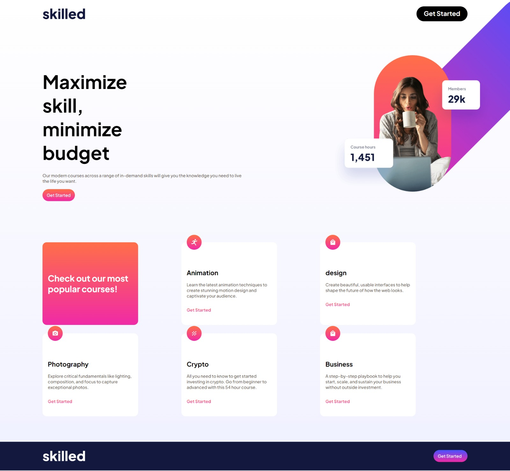

# Skilled e-learning landing page

This is a solution to the [Skilled e-learning landing page challenge on Frontend Mentor](https://www.frontendmentor.io/challenges/skilled-elearning-landing-page-S1ObDrZ8q).

### Screenshot

### Links

- Live Site URL: [Skilled e-learning landing page](https://elearning-webpage.vercel.app/)

### Built with

- Semantic HTML5 markup
- CSS custom properties
- Flexbox
- Grid

### What I learned
- Applied the combination of grid and flexbox effectively.
- Acquired a solid understanding of CSS positioning for better div arrangement.

### My process

1. Before adding any styles, structure your content with HTML. Writing your HTML first can help focus your attention on creating well-structured content.
2. Establish fundamental styles in your CSS, encompassing overall content preferences like font-family and font-size.
3. Approach styling incrementally, starting from the top of the page and progressing downwards. Ensure each section meets your satisfaction before advancing to the next. It's common to consult online resources for tags and CSS techniques during this process.